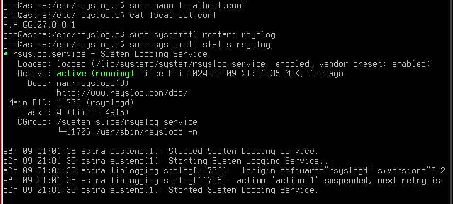
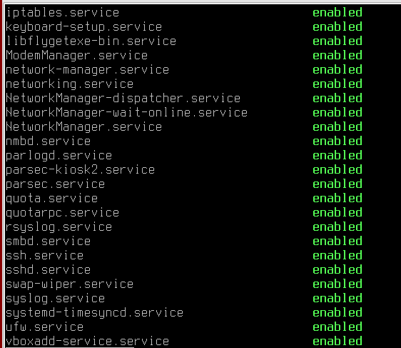

## 1.	Установка обновлений

### 1.1	Установка пакетов обновлений ОС ASTRA LINUX 1.6

Для выполнения процедуры установки пакетов обновлений ОС ASTRA LINUX 1.6 необходимо произвести просмотр перечня доступных для обновления репозиториев и обновление их кэша, в консоли терминала(администратор с добавлением sudo к следующим командам командам):
```bash
apt-get update
```
Для обновления всех установленных пакетов:
```bash
apt dist-upgrade
```
Можно проверить зависимости командой:
```bash
apt-get check
```
Для исправления зависимостей следует выполнить команду:
```bash
apt -f install
```
Перезагрузить машину.

### 1.2 Установка пакетов обновлений безопасности ОС ASTRA LINUX 1.6
Для выполнения процедуры установки пакетов обновлений безопасности ОС ASTRA LINUX 1.6 необходимо добавить пакеты обновлений на уровне репозиториев. Из сайта ["Справочный центр"](https://wiki.astralinux.ru/pages/viewpage.action?pageId=294405452) ОС Astra Linux необходимо скачать обновления по ссылке
```https://dl.astralinux.ru/astra/frozen/1.6_x86-64/1.6.14/iso/20240119SE16MD.iso``` \
или выполнить команду в терминале
```bash
wget wget https://dl.astralinux.ru/astra/frozen/1.6_x86-64/1.6.14/iso/20240119SE16MD.iso
```
Перейти в каталог с загруженным образом диска на обновляемой системе и выполнить проверку контрольной суммы. Целевое значение контрольной суммы
```ee0a5d0df42da645339d39bcd29788dc0e8180601e64d91b72449b5eb02f30ad```\
Для получения контрольной суммы выполнить команду: 
```bash
gostsum -d 20240119SE16MD.iso
```
Файл надо скачать/переместить в папку mnt. \

Далее, необходимо проверить параметры безопасности системы: \
Панель управления -> Безопасность -> Политика безопасности -> Настройки безопасности -> Системные параметры -> Убрать галочку в пункте "Запрет установки бита исполнения для пользователей".
 \
Далее в терминале вводится команды монтирования скачанного образа
```bash
sudo mount /mnt/filename.iso /media/cdrom
sudo apt-cdrom -m add
```
Терминал предложит ввести имя для диска. Необходимо ввести имя и продолжить.
```bash
sudo apt update
sudo apt dist-upgrade
```


Убедиться, что обновление может быть выполнено и если нет ошибок, обновить:
```bash
sudo apt -s dist-upgrade
sudo apt dist-upgrade
```
Сама программа установки выдает список пакетов с неудовлетворёнными зависимостями при завершении своей работы, кроме того можно проверить зависимости командой:
```bash
apt-get check
```
Для исправления зависимостей следует выполнить команду:
```bash
apt -f install
```

После выполнения обновления необходимо перезагрузить систему.

## 2. Управление учетными записями пользователей

### 2.1 Создание учетной записи

Для создания учетной записи:
```bash
sudo useradd -m -s /bin/bash newuser
```
Добавление пароля для созданного пользователя:
```bash
sudo passwd newuser
```
Для просмотра списка групп учетной записи:
```bash
sudo groups newuser
```
Для оздание группы пользователей (newgroup - имя группы):
```bash
sudo groupadd newgroup
```
Для добавления учетной записи в группу учетных записей:
```bash
sudo usermod -aG newgroup newuser 
```
Для удаления учетной записи из группы:
```bash
sudo gpasswd -d newuser newgroup 
```


### 2.2 Просмотр и изменене статуса блокировки учетной записи
Просмотра статуса блокировки учетной записи:

```bash
passwd -S testuser1
```
Вывод в консоли:
```testuser1 P 08/07/2024 0 99999 7 -1 ```

Эти параметры означают: \
P: Пароль активен. \
08/07/2024: Последняя дата изменения пароля. \
0: Пароль можно изменить в любой момент. \
99999: Пароль никогда не истечёт. \
7: Предупреждение об истечении пароля за 7 дней до истечения. \
-1: Аккаунт не будет заблокирован после истечения срока действия пароля. \
Этот вывод показывает, что пользователь testuser1 имеет активный пароль, который никогда не истекает, с предупреждением за 7 дней до потенциального истечения, и пользователю разрешено изменять пароль в любое время. \
Блокировка учетной записи:
```bash
passwd -l testuser1
```
Разблокировка учетной записи:
```bash
passwd -u testuser1
```
Удаление учетной записи (домашняя папка не удаляется):
```bash
userdel testuser1
```
Удаление группы учетных записей :
```bash
groupdel groupname
```


## 3. Резервное копирование конфигурационных файлов ОС
Перед выполнением работ по внедрению конфигурации Комплекса встроенных СрЗИ на базе операционной системы ASTRA LINUX 1.6 необходимо сделать копию всех конфигурационных файлов ОС, подлежащих изменению. Для автоматизации этого процесса можно воспользоваться скриптом [backup_configs.sh](./ProjectResources/backup_configs.sh) из папки [ProjectResources](./ProjectResources/) (перед запуском в терминале необходимо добавить права на исполнение chmod +x /имя/файла). Скрипт может запусстить пользователь с правами sudo.

## 4. Настройка Системы контроля действий привилегированных пользователей PAM и парольной политики в ОС ASTRA LINUX 
Библиотеки PAM или Pluggable Authentication Modules - это набор компонентов, предоставляющих программный интерфейс для авторизации пользователей в Linux. \
Для настройки параметров PAM, определяющих требования к сложности нового пароля для всех учетных записей ОС, необходимо в файле настроек /etc/pam.d/common-password внести изменения так, чтобы соответствующий фрагмент в файле /etc/pam.d/common-password принял следующий вид:
```
password	requisite			pam_cracklib.so retry=3 minlen=8 difok=3 dcredit=-1 ucredit=-1 lcredit=-1
```
```
password	[success=1 default=ignore]	pam_unix.so obscure use_authtok try_first_pass gost12_512
```
minlen – минимальное количество символов в пароле; \
lcredit, dcredit, ucredit – не менее 1 символа заглавной латинской буквы, 1 цифры и 1 специального символа в задаваемом пароле.

Для настройки парольной политики необходимо привести соответствующие строки в файле ```/etc/login.defs``` к следующему виду: \
PASS_MAX_DAYS 180  # максимальный период жизни пароля в днях \
PASS_MIN_DAYS 7    # минимальный период жизни пароля в днях \
PASS_WARN_AGE 14   # период предупреждения о скором истечении срока жизни пароля в днях.

Для определения парольной политики существующих в ОС, в консоли терминала объекта от имени учетной записи администратора выполнить следующую команду (повторить для всех локальных учетных записей существующих пользователей в ОС - меняем user_name): \
chage –M 180 user_name \
chage –W 14 user_name \
chage –m 7 user_name

## 5. Настройка прав доступа группы администраторов к логам ОС ASTRA LINUX
Например, создадим 4 учетные записи администраторов acl_1, acl_2, acl_3, acl_4. Далее создадим группу acl_group и добавим в нее созданных ранее пользователей. \
 \
Для добавления прав доступа группы администраторов **acl_group** к файлам регистрации событий (логам) ОС ASTRA LINUX 1.6 в консоли терминала от имени учетной записи администратора выполнить следующую команды:
 ```bash
sudo setfacl -m "g:acl_group:rx" /var/log/afick/
sudo setfacl -m "g:acl_group:rx" /var/log/apt/
sudo setfacl -m "g:acl_group:rx" /var/log/audit/
sudo setfacl -m "g:acl_group:rx" /var/log/cups/
sudo setfacl -m "g:acl_group:rx" /var/log/exim4/
sudo setfacl -m "g:acl_group:rx" /var/log/fly-dm/
sudo setfacl -m "g:acl_group:rx" /var/log/hp/
sudo setfacl -m "g:acl_group:rx" /var/log/installer/
sudo setfacl -m "g:acl_group:rx" /var/log/ntpstats/
sudo setfacl -m "g:acl_group:rx" /var/log/openvpn/
sudo setfacl -m "g:acl_group:rx" /var/log/private/
sudo setfacl -m "g:acl_group:rx" /var/log/samba/
sudo setfacl -m "g:acl_group:r" /var/log/afick/afick.log
sudo setfacl -m "g:acl_group:r" /var/log/afick/error.log
sudo setfacl -m "g:acl_group:r" /var/log/apt/history.log
sudo setfacl -m "g:acl_group:r" /var/log/audit/audit.log
sudo setfacl -m "g:acl_group:r" /var/log/cups/access_log
sudo setfacl -m "g:acl_group:r" /var/log/installer/syslog
sudo setfacl -m "g:acl_group:r" /var/log/installer/status
sudo setfacl -m "g:acl_group:r" /var/log/alternatives.log
sudo setfacl -m "g:acl_group:r" /var/log/aptitude
sudo setfacl -m "g:acl_group:r" /var/log/astra-history.log
sudo setfacl -m "g:acl_group:r" /var/log/auth.log
sudo setfacl -m "g:acl_group:r" /var/log/boot.log
sudo setfacl -m "g:acl_group:r" /var/log/btmp
sudo setfacl -m "g:acl_group:r" /var/log/daemon.log
sudo setfacl -m "g:acl_group:r" /var/log/debug
sudo setfacl -m "g:acl_group:r" /var/log/dpkg.log
sudo setfacl -m "g:acl_group:r" /var/log/faillog
sudo setfacl -m "g:acl_group:r" /var/log/fly-dm.log
sudo setfacl -m "g:acl_group:r" /var/log/fontconfig.log
sudo setfacl -m "g:acl_group:r" /var/log/kern.log
sudo setfacl -m "g:acl_group:r" /var/log/lastlog
sudo setfacl -m "g:acl_group:r" /var/log/messages
sudo setfacl -m "g:acl_group:r" /var/log/syslog
sudo setfacl -m "g:acl_group:r" /var/log/user.log
sudo setfacl -m "g:acl_group:r" /var/log/wtmp
```

## 6. Установка и настройка утилиты контроля целостности afick на ОС ASTRA LINUX 
AFICK (Audit File Integrity Checker) - это инструмент для проверки целостности файлов в операционной системе Linux. Он предназначен для мониторинга изменений в файловой системе и обнаружения любых несанкционированных изменений в важных системных файлах.

AFICK работает путем создания контрольных сумм (MD5 или SHA1) для всех файлов в определенных каталогах и последующего сравнения этих контрольных сумм с предыдущими значениями. Если обнаруживаются какие-либо различия, AFICK может отправить уведомление администратору системы или даже заблокировать систему до тех пор, пока проблема не будет решена.

AFICK часто используется в системах, где важна безопасность и надежность, таких как серверы, банковские системы и другие критически важные приложения. Он помогает предотвратить несанкционированный доступ к файлам и защитить систему от вредоносного ПО, которое может изменить важные файлы.

Необходимо изменить файл /etc/afick.conf (представле в папке [ProjectResources](./ProjectResources/afick.conf)).
Для корректности настроек необходимо создать папку **/var/log/afick/history**. \
 \
Чтобы произвести первичную инициализацию утилиты **AFICK**, необходимо в терминале от имени пользователя с правами sudo выполнить команду ```afick -i```.
  \
Запустить программу контроля целостности в режиме проверки от имени пользователя с правами sudo ```afick -k```.
 \
При запуске AFICK автоматически установит ежедневное задание для CRON. Файл с заданием находится в ```/etc/cron.daily/afick_cron```.
Результат проверки будет отражен в файлах журнала ```/var/log/afick/archive/*``` и в терминале (в случае ручного запуска проверки).

## 7.	Настройка блокирования сеанса доступа в информационную систему после установленного времени бездействия 
Параметры автоматической блокировки графической сессии устанавливаются с помощью графического инструмента «Оформление Fly» (fly-admin-theme). Инструмент доступен из графического меню: "Пуск" -> "Панель управления" -> "Рабочий стол" -> "Оформление Fly" -> "Блокировка".


## 8. Настройка ротации и хранения файлов журналов аудита на ОС ASTRA LINUX
Настройка ротации и хранения логов необходима для обеспечения безопасности и надежности работы системы. Вот несколько причин, почему это важно:

- Защита от переполнения диска: Журналы аудита могут занимать много места на диске, особенно при активном использовании системы. Если диск переполнится, система может перестать работать корректно. Ротация позволяет удалять старые записи и освобождать место на диске.
- Удобство анализа: Когда журналов много, их анализ становится сложным. Ротация позволяет разделить журналы по датам или другим критериям, что упрощает поиск нужной информации.
- Соответствие требованиям: Многие организации имеют строгие правила и политики, касающиеся хранения и защиты данных. Ротация и хранение файлов журналов аудита помогают соблюдать эти требования.
- Предотвращение злоупотреблений: Если злоумышленник получит доступ к журналам аудита, он может использовать эту информацию для своих целей. Ротация и хранение файлов позволяют минимизировать риск утечки конфиденциальной информации.
- Анализ инцидентов: В случае возникновения инцидента безопасности или других проблем, журналы аудита могут предоставить ценную информацию для расследования. Ротация и хранение позволяют сохранить эти данные для последующего анализа.

Для настройки ротации в основной файл конфигурации утилиты **/etc/logrotate.conf** надо добавить строку:
```bash
include /etc/logrotate.d
```
В каталоге **/etc/logrotate.d** необходимо создать файл **logrotate.conf** с правилами ротации и хранения файлов журналов аудита. Пример файла ```/etc/logrotate.d/logrotate.conf``` можно посмотреть в папке [ProjectResources](./ProjectResources/logrotate.conf).
Добавить задание по периодическому выполнению по расписанию процедуры ротации и хранения файлов журналов аудита в планировщик выполнения заданий cron можно командой от имени пользователя с правами sudo 
```bash
crontab -e
```
В открывшемся редакторе надо добавить строку в расписание:
```bash
* 0 * * * /usr/sbin/logrotate /etc/logrotate.d/logrotate.conf
```
Где 0 – точное время в часах выполнения задачи проверки целостности объектов.  


## 9. Настройка отправки логов в систему сбора событий по протоколу syslog
Надо создать (или отредактировать) файл **/etc/rsyslog.d/localhost.conf**:
```bash
*.* @@127.0.0.1
```
Здесь:
- *.* означает, что все сообщения всех уровней и всех типов будут передаваться на сервер;
- @@127.0.0.1 — это IP-адрес localhost, указывающий, что логи будут передаваться на локальную машину. Двойной знак @@ указывает на использование TCP-протокола для передачи данных (@ - указывает на использование UDP-протокола). \
Чтобы применить изменения - перезапуск службы rsyslog:
```bash
sudo systemctl restart rsyslog
```
Для проверки, что конфигурация работает, можно использовать команду logger, чтобы сгенерировать тестовое сообщение и убедиться, что оно было отправлено и обработано:
```bash
logger "Test message to localhost"
sudo grep "Test message to localhost" /var/log/syslog
```



## 10. 	Настройка параметров безопасности для подключения по протоколу SSH 
Для настройки параметров безопасности для подключения по протоколу SSH необходимо привести соответствующие строки в файле **/etc/ssh/sshd_config** к следующему виду:
```
#security
UsePAM yes 
PermitRootLogin no 
PasswordAuthentication yes 
PubkeyAuthentication yes 
ChallengeResponseAuthentication yes 
```
UsePAM yes - можно использовать методы аутентификации, такие как пароли, ключи и т.д.
PermitRootLogin no - запрещает вход в систему через SSH с учетной записью root
PasswordAuthentication yes - разрешает аутентификацию с использованием пароля
PubkeyAuthentication yes - разрешает аутентификацию с использованием публичных ключей
ChallengeResponseAuthentication yes - разрешает использование метода аутентификации Challenge-Response, который может включать в себя ввод одноразового пароля и т.д.
Произвести перезапуск службы сервиса управления логами rsyslog и sshd, в консоли терминала объекта от имени пользователя с правами sudo выполнить команды:
```bash
sudo systemctl restart rsyslog
sudo systemctl restart sshd
```


## 11. 	Настройка регистрации удачных и неудачных попыток входа в систему в ОС ASTRA LINUX 1.6
Для настройки регистрации удачных и неудачных попыток входа в систему необходимо выполнить установку пакетов auditd и audispd-plugins:
```bash
sudo apt install auditd audispd-plugins
```
Файл конфигурации [audit.conf](./ProjectResources/auditd.conf) должен быть сохранен так __/etc/audit/auditd.conf__.
Строки пришлось закомментировать, как как текущая установленная версия не поддерживает данные параметры:
```bash
transport = TCP
q_depth = 400
overflow_action = SYSLOG
max_restarts = 10
plugin_dir = /etc/audit/plugins.d
```
Изменённый файл [audit.rules](./ProjectResources/audit.rules) надо созранить по адресу __/etc/audit/rules.d/audit.rules__.

Произвести чтение правил аудита из файла утилитой auditctl, в консоли терминала объекта от имени учетной записи администратора выполнить следующую команду:
```bash
sudo auditctl -R /etc/audit/rules.d/audit.rules
```

## 12.	Останова неиспользуемых сервисов

Для останова сервисов необходимо выполнить следующие действия:
1. Вывести текущий список автоматически запускаемых при старте ОС сервисов, в консоли терминала объекта от имени учетной записи администратора выполнить следующую команду:
```bash
systemctl list-unit-files --state=enabled
```
 \
2. Согласно списку рекомендованных к отключению сервисов, выполнить деактивацию всех неиспользуемых для функционирования объекта ИТ-инфраструктуры сервисов, с помощью следующих команд (на примере сервиса ufw.service):
```bash
systemctl stop ufw.service
systemctl disable ufw.service
```

## 13.	Установка и настройка локального файерволла и Selinux на ОС ASTRA LINUX 1.6
Чтобы проверить текущее состояние файерволла ufw, надо в консоли терминала от имени учетной записи с правами администратора выполнить команду:
```bash
 ufw status
```
 В нашем случае получаем результат "Status: inactive". Для включения:
 ```bash
 ufw enable
```

Чтобы проверить текущее состояние сервиса Selinux, надо в консоли терминала от имени учетной записи с правами администратора выполнить команду:
```bash
sestatus
```
Далее ривести файл **/etc/selinux/config** к следующему виду:
```bash
SELINUX=permissive
SELINUXTYPE=targeted
```
После этого перезагрузить ОС и повторить команду:
```bash
sestatus
```
В нашем случае проверка статуса selinux возвращает ответ "Команда не найдена", файла **/etc/selinux/config** не существует. После создания конфигурационного файла и перезагрузки ОС статус selinux не меняется. Возможно причина отсутствия модуля в ядре линукс
 

## 14. Настройка сервиса синхронизации системного времени NTP
Для настройки синхронизации системного времени с NTP сервером необходимо:
1. Произвести установку пакета сервиса (если он еще не установлен) chrony от имени пользователя с правами sudo:
```bash
apt install chrony
```
2. Изменить конфигурационный файл **sudo nano /etc/chrony/chrony.conf**, в данном случае, закомментирована строка:
```bash
pool 2.debian.pool.ntp.org iburst
```
Добавлена строка:
```bash
server ntp.ix.ru iburst
```
3. Добавить __chrony__ в автозагрузку:
```bash
sudo systemctl enable chrony
```
4. Перезапуск __chrony__ чтобы применить новые параметры
```bash
sudo systemctl restart chrony
```
5. Проверка списка текущих источников для синхронизации времени NTP:
```bash
sudo chronyc sources
```
Для проверки состояния синхронизации времени NTP, в консоли терминала объекта выполнить следующую команду:
```bash
sudo chronyc tracking
```
 

 В данном выводе:

__Reference ID__: Идентификатор источника времени, с которого система синхронизируется. C2BEA801 — это идентификатор IP-адреса ntp.ix.ru в шестнадцатеричной форме, указывающий, что этот сервер используется в качестве источника времени.

__Stratum__: Уровень сервера в иерархии NTP. Уровень 2 означает, что сервер находится на втором уровне иерархии (то есть синхронизируется с сервером уровня 1). Чем ниже значение stratum, тем ближе сервер к первичному источнику времени (уровень 0).

__Ref time (UTC)__: Время, в которое сервер ntp.ix.ru синхронизировался с другим сервером. Это время используется для определения смещения между системным временем и временем на сервере.

**Время синхронизируется с сервером ntp.ix.ru с минимальным отклонением, что свидетельствует о правильной и точной синхронизации времени. Все значения показывают, что система работает нормально и корректно синхронизируется с источником времени.**