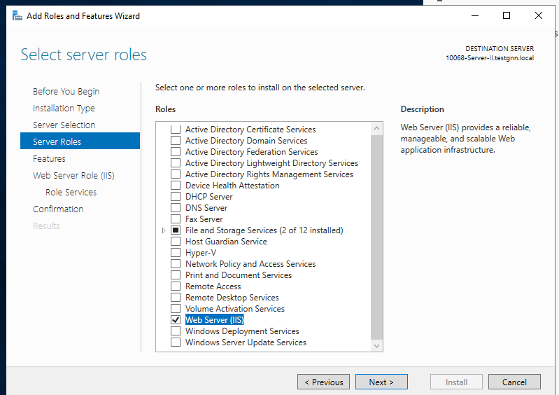

## Создание IIS сервера
Для создания IIS сервера нужно запустить на сервере с ОС Windows Server диспетчер серверов:
Server Manager -> Dashboard -> Manage -> Add Roles and Features -> Next -> Role-based Installation -> Next -> Next -> Web Server (IIS) -> Next
Add Features -> Next -> Next -> Next -> Next
