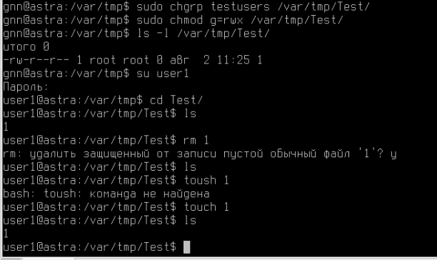

## ОС Linux (Astra Linux)

1. Создание пользователя user1

**Первый вариант:**

```bash
sudo useradd -m -s /bin/bash user1
sudo passwd user1
```
Где \
useradd - команда для добавления нового пользователя; \
-m - создает домашний каталог для пользователя; \
-s /bin/bash - устанавливает Bash в качестве оболочки по умолчанию; \
user1 - имя создаваемого пользователя; \
sudo passwd user1 - изменяет пароль для пользователя user1.

**Второй вариант:**
```bash
sudo adduser user1
```
После выполнения этой команды начинается диалог по созданию пользователя. Надо задать пароль. Full Name, Room Number, Work Phone, Home Phone, Other - эти поля можно оставить пустыми, нажав Enter.

Для проверки, что пользователь создан успешно, можно выполнить команду:
```bash
id user1
```
Эта команда покажет информацию о новом пользователе, включая его UID, GID и группы. 

2. Создание папки Test1 в папке /var/tmp/
```bash
mkdir /var/tmp/Test
```
3. Добавление права на чтение и запись для учетной записи user1 на папку /var/tmp/Test1
```bash
sudo chown user1 /var/tmp/Test1
sudo chmod 700 /var/tmp/Test1
```
chown user1 /var/tmp/Test1 - меняет владельца папки Test1 (владелец - user1) \
chmod 700 /var/tmp/Test1 - право на чтение, запись и исполнение у владельца папки (у группы пользователя и всех остальныз прав нет)

Пример создания файла в папке /var/tmp/Test1 представлен ниже:
 

4. Настройка разрешений учётной записи user1 подключение по ssh \
Проверить, что ssh установлен и запущен
```bash
sudo systemctl status ssh
```
Если не установлен, установить:
```bash
sudo apt-get update
sudo apt-get install openssh-server
```
После окончания установки можно снова проверить статус ssh, если служба не запущена, запустить:
```bash
sudo systemctl start ssh
```
Чтобы убедиться, что SSH-сервер будет автоматически запускаться при загрузке системы, выполнить:
```bash
sudo systemctl enable ssh
```
SSH-конфигурация настраивается в файле /etc/ssh/sshd_config. Проверить параметры AllowUsers или DenyUsers в этом файле. Обычно, если конфигурация по умолчанию разрешает доступ, изменений не требуется. \
Основные параметры, которые могут влиять на SSH-подключения: \
__PasswordAuthentication__ \
Если этот параметр установлен в "no", это значит, что аутентификация с использованием пароля отключена. Пользователи не смогут подключаться через SSH, используя пароли. Это может быть причиной проблем, при попытке подключиться с помощью пароля, а не с помощью ключей SSH.
Если нужно разрешить аутентификацию паролем, измените эту строку на:
```
PasswordAuthentication yes
```

__KbdInteractiveAuthentication__ \
 Это параметр определяет, разрешена ли интерактивная аутентификация клавиатуры (например, для Challenge-Response аутентификации). Если он установлен в no, это означает, что интерактивные методы аутентификации отключены.
Если нужно разрешить такие методы аутентификации, изменить эту строку на:
```
KbdInteractiveAuthentication yes
```
__PermitRootLogin__ \
Этот параметр определяет, можно ли подключаться к серверу как root. Значение prohibit-password позволяет подключаться только с использованием ключей SSH, а не пароля.
Если нужно разрешить root-доступ через SSH, изменить значение на:
```
PermitRootLogin yes
```
\
После изменений перезапустить SSH-сервер:
```
sudo systemctl restart ssh
```

5. Скопировать текстовый файл с Windows 10 в папку /var/tmp/Test1 на сервере с ОС Linux, используя WinSCP

[Скачать](https://winscp.net/eng/download.php) и установить на Windows 10 программу WinSCP. При установке:
- принять лицензионное соглашение;
- выбрать папку для установки;
- выбрать, надо ли создать ярлыки на рабочем столе и в меню "Пуск";
- выбрать тип установки (Рекомендуется "Full installation");
- нажать "Install", чтобы начать установку. \
При первом запуске может быть предложено настроить соединение с сервером. Заполнить необходимые данные (адрес сервера, имя пользователя, пароль) для подключения к серверу.

Найти файл на компьютере с Windows 10. Для этого, в левой панели навигации найти и выбрать файл, который надо скопировать на сервер.

Выберать место назначения на сервере - в правой панели навигации выбрать папку на сервере, куда надо скопировать файл (если нужной папки нет, можно создать новую, щелкнув правой кнопкой мыши и выбрав "New" -> "Directory").

Скопировать файл - перетащть файл из левой панели в правую. Альтернативно - щелкнуть правой кнопкой мыши на файле в левой панели и выбрать "Upload" (Загрузить). Появится диалоговое окно с параметрами копирования. "OK" - чтобы начать копирование.

Убедиться, что файл появился в нужной папке на сервере, просмотрев правую панель.